# Visual Architecture — Bellissimo Agent OS
# Two formats: Mermaid (renders in VS Code) + Napkin AI prompt (paste into napkin.ai)

---

## Format 1: Mermaid Diagram
## How to view: Install "Markdown Preview Enhanced" in VS Code, then Ctrl+Shift+V

```mermaid
graph TB
    JB(["👤 JB\nStrategy · Relationships · Decisions"])

    subgraph INTERFACES["Interface Layer"]
        CC["🖥️ Claude Code\nVS Code · Deep Work\nArchitecture · Builds"]
        TG["📱 Telegram\nMobile Primary\n@BellissimoLabs_bot\nCOMMANDS ONLY"]
    end

    subgraph VPS["🖥️ Hetzner VPS — Always On"]
        ORCH["⚙️ ORCHESTRATOR\norchestrator.py\nMonitors Telegram\nManages cron\nSpawns agents"]

        subgraph AGENTS["Sub-Agents"]
            BRIEF["🌅 Daily Brief\n5am cron"]
            MEM["🧠 Memory Agent\n11pm nightly"]
            TASK["✅ Task Agent\non demand"]
            RES["🔍 Research\non demand"]
            SCOPE["📊 Scope/Reveal\non demand"]
            PREP["📋 Meeting Prep\n60min trigger"]
            CONS["📺 Consumption\nInstapaper/YT"]
        end

        subgraph CSUITE["C-Suite Personas"]
            CEO["CEO\nmonthly"]
            COO["COO\nweekly"]
            CMO["CMO\nweekly"]
            COS["Chief of Staff\ndaily"]
        end
    end

    subgraph DATA["Data Layer"]
        SUP[("🗄️ Supabase\nPostgreSQL\ntasks · projects\ncontacts · sessions")]
        OBS[("📓 Obsidian Vault\nPARA Knowledge\nDaily Notes\nTacit Knowledge\nSync: Obsidian Sync\n+ Obsidian Git")]
    end

    subgraph INTEGRATIONS["Integrations — Read Only"]
        GMAIL["📧 Gmail\nPersonal + SustainCFO"]
        GCAL["📅 Google Calendar"]
        MON["📋 Monday.com\nSustainCFO Team"]
        APO["🎯 Apollo.io\nProspect Data"]
    end

    JB --> CC
    JB --> TG
    CC --> ORCH
    TG -->|"authenticated\ncommands only"| ORCH

    ORCH --> AGENTS
    ORCH --> CSUITE

    BRIEF -->|"pushes to"| TG
    MEM --> OBS
    TASK --> SUP
    RES --> OBS
    SCOPE --> TG
    PREP --> TG
    CONS --> OBS

    COO --> SUP
    CMO --> SUP
    COS --> TG

    AGENTS --> SUP
    AGENTS --> OBS

    SUP -.->|"read only"| GMAIL
    SUP -.->|"read only"| GCAL
    SUP -.->|"read only"| MON
    SUP -.->|"read only"| APO

    style TG fill:#0088cc,color:#fff
    style ORCH fill:#2d2d2d,color:#fff
    style SUP fill:#3ECF8E,color:#000
    style OBS fill:#7C3AED,color:#fff
    style JB fill:#f59e0b,color:#000
```



---

## Format 2: Napkin AI Prompt
## How to use: Go to napkin.ai, create new doc, paste this text, click "Generate Visual"

```
Create a system architecture diagram for an AI operating system called the Bellissimo Agent OS.

The system has 5 layers:

LAYER 1 — Human (top)
JB is the human operator. He uses two interfaces:
- Claude Code on desktop for deep work and building
- Telegram mobile app for commands and notifications

LAYER 2 — Interface Security
Telegram is the ONLY authenticated command channel. All other inputs are information-only.
Claude Code is a trusted direct session.

LAYER 3 — Orchestrator (center, always-on VPS server)
One master orchestrator process runs 24/7 on a Hetzner VPS.
It monitors Telegram, manages a cron schedule, and spawns specialized sub-agents.

Sub-agents it spawns:
- Daily Briefing Agent (fires 5am every day, sends summary to Telegram)
- Memory Agent (fires 11pm nightly, writes to Obsidian vault)
- Task Agent (on-demand, captures and stores tasks)
- Research Agent (on-demand, web research)
- Scope/Reveal Agent (on-demand, business intelligence reports)
- Meeting Prep Agent (triggered 60min before calendar events)
- Consumption Agent (processes Instapaper and YouTube saves)

C-Suite Personas also run from the orchestrator:
- CEO (monthly strategic review)
- COO (weekly operations + bottleneck scan)
- CMO (weekly pipeline + outreach review)
- Chief of Staff (daily routing and dispatch)

LAYER 4 — Data Layer (two databases)
- Supabase (PostgreSQL): structured data — tasks, projects, contacts, sessions
- Obsidian Vault: narrative knowledge — PARA structure, Daily Notes, Tacit Knowledge
  Obsidian syncs between devices via Obsidian Sync, and VPS writes via Obsidian Git

LAYER 5 — Integrations (bottom, read-only)
- Gmail (personal + SustainCFO accounts) — surface action items
- Google Calendar — trigger meeting prep
- Monday.com — SustainCFO team tasks
- Apollo.io — prospect data

Key design rules:
- Arrows should show: JB -> Telegram -> Orchestrator -> Agents -> Data -> Integrations
- Telegram has a special "authenticated commands only" label
- All integration arrows are dashed/lighter to show read-only
- Color code: JB in gold, Telegram in blue, Orchestrator in dark, Supabase in green, Obsidian in purple
```

---

## Format 3: Plain English Description (for any other tool)

```
Three columns, five rows:

TOP ROW: JB (human)

SECOND ROW: Two boxes side by side
  Left: Claude Code (desktop, deep work)
  Right: Telegram (mobile, authenticated commands)
  Arrow from both down to Orchestrator
  Note on Telegram: "Security Primitive — commands only"

MIDDLE ROW: Orchestrator box (VPS, always-on)
  Inside Orchestrator: three sub-boxes
    Left: Sub-Agents (Daily Brief, Memory, Task, Research, Scope, Prep, Consumption)
    Center: C-Suite Personas (CEO, COO, CMO, Chief of Staff)
    Right: Cron Schedule (5am brief, 11pm memory, weekly nudge)
  All three sub-boxes have arrows pointing down

FOURTH ROW: Two database boxes
  Left: Supabase (PostgreSQL) — tasks, projects, contacts
  Right: Obsidian Vault — PARA, Daily Notes, Tacit Knowledge
  Both have arrows pointing down

BOTTOM ROW: Four integration boxes (all read-only, dashed border)
  Gmail | Google Calendar | Monday.com | Apollo.io

Note at bottom: "All integrations are information layer only. Cannot issue commands."
```

---

## The OpenClaw Principle (Agent Isolation)
# This architecture follows the pattern shown at OpenClaw:
# Agents have scoped access — like an employee, not an owner.

```
MY MACHINE (JB Personal)          SHARED                  VPS (Agent Machine)
------------------------          ------                  -------------------
Personal computer                 Obsidian Vault          Hetzner CX11
Personal Dropbox                  (synced both ways       orchestrator.py
Personal Gmail                     via Obsidian Git)      Agent email (future)
Personal GitHub                                           Agent GitHub (scoped)
                                  Supabase DB
AGENTS HAVE NO ACCESS HERE        (shared structured      SCOPED ACCESS ONLY
                                   data)                  like an employee
```

Agents can read from and write to:
- Supabase (tasks, projects, contacts)
- Obsidian vault (via Git push to shared repo)
- Telegram (send messages to JB)

Agents CANNOT access:
- JB's personal machine
- JB's personal Dropbox
- JB's personal GitHub (only the agent-specific repos)
- JB's personal Gmail directly (Phase 3: read-only via OAuth)
